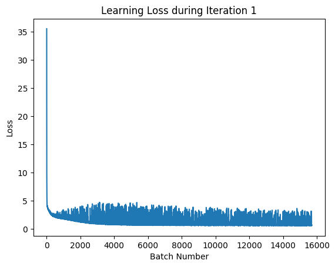
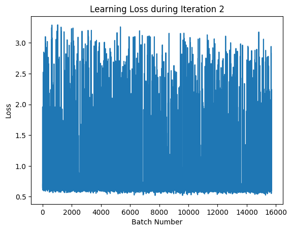
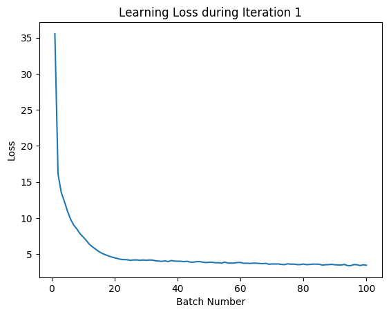
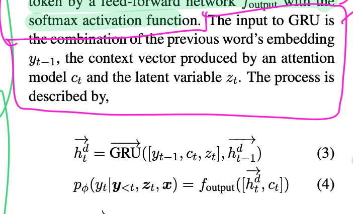

# Logs

These logs are used to indicate progress of the project as I work on it through the year. It also serves as a scratchpad for things that may be useful/relevant for the ISO.

## To-Do

- [x] Blitz through [this 60 minute tutorial](https://pytorch.org/tutorials/beginner/deep_learning_60min_blitz.html) on PyTorch.
- [x] Create notes on Goldberg's NLP Paper
- Summary of Baselines:
    - [x] Concise summary of seq2seq
    - Concise summary of Transformer paper
- [ ] Cover Controllable Story Generation paper
- [ ] Model the implemented `seq2seq` code around the ISO problem so we can use it as a benchmark.
- [ ] Finish the literature survey writeup.

----

## 2019/04/03 (Wednesday)
- Good news, the model successfully trained on the dataset.
- 
- 
- Bad news, I accidentally cut the dataset such that the sequence is of length 14. (It used the 40th most popular sequence length). I've now hard coded it to length 60.
- Worse news, I have to retrain the model again (With sequence length 60)
- Built [model evaluators](code/vad_evaluate.ipynb) to determine model success.
- I'll have to wait quite a while for the model to train. (According to the model it'll take 3 hours, 10mins to train 1 epoch - I've trained it for 3 hours. At the time of writing it's 13:34pm so I'll check it out at 10pm.)
- Here's the model parameters I'm using:

        hiddenSize = 512
        latentSize = 400
        batchSize  = 32
        iterations = 3
        learningRate = 0.0001
        DatasetReduction = 1/8 (i.e we're looking at 7876 reviews)


## 2019/04/02 (Tuesday)
- Updated the data processing mechanism s.t data comes out looking like the following (Note that the sentences have the identity concatenated to it):

        ENTRY: {'reviewerID': 'A21AX7U9UNIV75', 'asin': 'B00000JD4V', 'reviewerName': 'Amazon Customer "SWNovice"', 'helpful': [3, 3], 'reviewText': "I've had my radio for about six months now and I could not be happier.  It pulls in stations from all over the globe 24 hours a day.  It is easy to use and extremely reliable.  I recently took it to Mexico with me so I could keep up on U.S. news and it provided me with several U.S. broadcasts.  I love this radio.", 'overall': 5.0, 'summary': 'Awesome radio', 'unixReviewTime': 1113091200, 'reviewTime': '04 10, 2005'}
        IDENTITY: ['b', '0', '0', '0', '0', '0', 'j', 'd', '4', 'v', 'rating_5.0', 'polarity_0.0']

        ['<sos>', 'awesome', 'radio']
        ['i', "'", 've', 'had', 'my', 'radio', 'for', 'about', 'six', 'months', 'now', 'and', 'i', 'could', 'not', 'be', 'happier', '.']
        ['it', 'pulls', 'in', 'stations', 'from', 'all', 'over', 'the', 'globe', '24', 'hours', 'a', 'day', '.']
        ['it', 'is', 'easy', 'to', 'use', 'and', 'extremely', 'reliable', '.']
        ['i', 'recently', 'took', 'it', 'to', 'mexico', 'with', 'me', 'so', 'i', 'could', 'keep', 'up', 'on', 'u', '.', 's', '.']
        ['news', 'and', 'it', 'provided', 'me', 'with', 'several', 'u', '.', 's', '.']
        ['broadcasts', '.']
        ['i', 'love', 'this', 'radio', '.', '<eos>']
- However, not sure if it is a good idea to split the itemID by the character.
- I've noticed that the NLLLoss is decreasing at a steady constant rate (which is good!!) but the KL divergence is causing a large issue.
- Fixed KLD loss
- Noticed that KL quickly converges to zero(?)
- [ ] Might need to implement teacher forcing?
- [ ] Look at KL Annealing methods.
- I've managed to make the model learn!
- 
- 
- I'm currently training the model on a subset for the time being (It will take 4 hours based on `tqdm`'s estimate.) I've written some scratch code to print charts and store model parameters after training so we can evaluate performance on the validation set.
        

## 2019/04/01 (Monday)
- Updated data processing mechanism to allow sentence by sentence input
- Reduced input vocabulary size to 30k
- Presplit training and validation data by the data processing notebook
- Need to add padding to sequences
- Fixed critical KL mechanism bug where gradients were not being pushed through sampling method
- Gradients are being pushed through but the loss is massively fluctuating based on the location of the sequences. (This could be promptly fixed with shuffling)
- I'll need to look at how the data is being represented and see how messed up it is
- I'll also need to refactor the data-processing mechanism so that others can simply run the code (and it'll download the dataset, preprocess and package ready for use with the model.)

## 2019/03/30 (Saturday)
- Fix attention mechanism and double check for gradient loss

## 2019/03/29 (Friday)
- [Model can run forward passes no problem on the batched dataset.](code/vad.py)
- [00:12] Model runs for one batch, but the loss dissappears entirely on the second batch. This would mean that gradients are not appropiately pushed through. I'll need to look into this.
- I should start with looking at all the `squeeze()` and `unsqueeze()` functions, and looking at the matrix operations of the input as it goes through the model.
- Model also takes an incredibly long time to perform operations, especially with the parameter sizes mentioned in the paper. Training may take a day, and this is with 1/16th of the dataset (and with vector operations!!) 
    - With the following parameters, it takes 15 minutes to go through one iteration:
        ```
        dataShrink = 1/16
        hiddenSize = 128
        featureSize = 128
        latentSize = 128
        iterations = 10
        bidirectionalEncoder = True
        batchSize = 32
        ```
    - I should talk to my supervisor about this.
- Now that I have a working dataset, I'll need to look at implementing other models such as the vanilla seq2seq and a regular Transformer on the dataset because I need charts to indicate anything wrong with the data representation...
- Need to draw a flowchart of the vector dimension operations to see cases where I've messed up.

## 2019/03/28 (Thursday)
- Changed decoder output to one-hot
- Verified that one-pass can occur with current flow (but this will be broken as we're moving to batched operations)
- Dataset needs to be rewritten as the input is presently `[itemID, summary, rating, polarity, review]` but this does not work with PyTorch as there would exist padding in the middle of the sequence. It'll need to be rewritten as `[ItemID, rating, polarity, summary, review]`.
    - Other than it working on PyTorch properly, this may actually work much better for these reasons:
    - More space for number of words overall for review
    - the remainder of the text would have context on the rating and polarity.
- Building data batching mechanism because realistically this model will take quite a long time to train compared to the other approaches. (The PyTorch tutorial on Seq2Seq is not batched!) - I'll be using [this tutorial.](https://github.com/howardyclo/pytorch-seq2seq-example/blob/master/seq2seq.ipynb)
- ~~Need to update data batching as the backwards model requires the output to be in reverse.~~ (Done; output is literally reversed s.t the padding is at the front, but I would imagine that padding order does not make a difference anyway)
- Built data batching mechanism
- Presently updating the VAD implementation to support batches.
- Initial commit of running model.

### 2019/03/27 (Wednesday)
- More bug-fixes on components
- The paper does not explicitly mention how the variables are joined together other than "a combination" so I was a bit confused.
    
    - For now I've just concatenated the variables together.
- Focused on changing model components to fit single-case batch (which I should change later)

### 2019/03/26 (Tuesday)
- Used glove weights for dataset for now (reflected as changes in code)
- Moved VAD code to dedicated python file for better debugging
- Pickled datasets with weights

### 2019/03/25 (Monday)
- Converted dataset into form
- Added multiprocessing and log bars to indicate progress of model updating
- Setup code-server for remote IDE work alongside jupyter
- I'll need a method later to split the review by sentence but for now we'll create an autoencoder style implementation.


### 2019/02/15 (Friday)
- Discussed the weird auxillary function, and asked on the rationale behind using 1 layer neural networks for many of the components with supervisor.
- Added GloVe embeddings.
- Initial definition of all components (except for the auxillary function)
- Reimplemented KL Divergence function
- Added GloVe embeddings to encoder and decoder
- Split the attention mechanism away from the decoder s.t the context vector can be used in other components.
- Added Xavier weight initialisation and adam optimisers.
- Initial setup for code.

#### Todo:
- [ ] Start implementing the transformer paper.
- [ ] Get a working model for seq2seq on our dataset.


### 2019/02/02 (Saturday)
- [Continued working on implementation on VADs.](Samples/VAD.ipynb).
- Looked into [BERT](https://www.youtube.com/watch?v=0EtD5ybnh_s).
- Looked into RVAEs (to see the implementation differences).
- Covered [KL Divergence and ELBO](https://www.youtube.com/watch?v=uaaqyVS9-rM). These are used for the decoder function for VADs.
- The research paper in question does not post dimensions for inference and model dimensions. Because it looks like a regular autoencoder of a sort.
- There's a bunch of neural networks in this model but they do not explicitly mention which ones are trained. For now, I'm assuming that all the networks have gradients to be pushed on them.
    - Forward RNN Encoder
    - Forward RNN Decoder
    - Backwards RNN (To condition the z value)
    - Inference Network
    - Prior Network
    - Auxillary Network
- The research paper does not indicate the structure or activation functions of the neural nets for the Inference, Prior, and auxillary networks..??
- I'm also not really sure what the conditioning variable is in the model. For now, the objective is to replicate the paper (with the dataset) so I'll need to download the glove word vectors but I'm also going to look into Bert aswell. Alternatively, I could create my own word vectors based on the Amazon dataset but that's something I should talk to the supervisors about.

### 2019/01/28 (Monday)
- Started implementation of [seq2seq with a variational autodecoder](Samples/seq2seq%20with%20Variation.ipynb).
- Looked into [bidirectional RNNs](https://invidio.us/watch?v=bTXGpATdKRY).
- Short [implementation of bidirectional rnns](Samples/Bidirectional%20RNN.ipynb).
- Looked into the [reparamerisation trick](https://www.youtube.com/watch?v=9zKuYvjFFS8).
- Looked into [ELBO](http://edwardlib.org/tutorials/klqp) but it's still quite unintuitive so I'll most likely have to spend more time into this.

### 2019/01/26 (Saturday)
- Analysed the VAE implementations that I've managed to find to see how other people have implemented them.

### 2019/01/18 (Friday)

- Update literature review to reflect changes during meeting on Tuesday 2019/01/15.
    - Changes are reflected in commented out tasks in the `.tex` document. They are yet to be written, but a shift in focus has been made and I should start working on baseline measurements (with Transformers).
- Downloaded sample transformer code on Github and tested to check if it is up to scratch.
    - It was not up to scratch, its performance was limited at best. I'll have to either look into why it was not so good, or build my own (which I am admittedly attempting to avoid).
- I'll need to implement the data-extraction methods with OpenMNT-py.

### 2019/01/10 (Thursday)

- Updated literature survey introduction to revolve around the topic's NLP problem
- Added section on Language Modelling
- removed section on Neural Networks and merged that in language models
- Read a topic on [VRNNs](#).
- Added multiple notebooks on VAEs and a notebook on VRNNs. 
- Another read through on the VAD paper; I understand a lot more than when I went through it the first time. 
- I need to look into the auxillary objective.
- Not sure how the backwards RNN is trained. I'll need to draw a dependency graph. I should start with looking at the re-parameterisation trick on VAEs before I do anything else.
- Julia gave me a bunch of things I should read.	

### 2019/01/02 (Wednesday)

- Read through this [approachable description on VAEs](https://jaan.io/what-is-variational-autoencoder-vae-tutorial/).
- There's this other topic on [using VAEs to draw pictures](http://blog.otoro.net/2016/04/01/generating-large-images-from-latent-vectors/) that I should look into.

### 2018/12/31 (Monday)

- Initial skim through of the VAD paper.
- Attempting to understand the VAD model (Figure 2 in the paper) which involves combining VAEs with seq2seq networks.

### 2018/12/28 (Friday)
- Updated writeup and included appropiate references.
- Added diagrams of the CVAE architecture and expanded on the different autoencoders.

### 2018/12/27 (Thursday)

- Initial writeup for the theorical aspects of the paper. Lots of more reading is needed.
- The difference between VAEs and CVAEs does not look huge. I'll want to look into this in more detail.
- I'll need to make diagrams for regular autoencoders, LSTMs, RNNs, GRUs, Seq2seq, CVAEs, and VADs.

### 2018/12/26 (Wednesday)

- Retrieved large dataset from Julain McAuley (julian.mcauley@gmail.com).
- Talked to Julia about the most appropiate method for structuring the theoretical part of the ISO writeup.

### 2018/12/21 (Friday)

- Reviewed [Attention in Neural Networks](https://www.youtube.com/watch?v=W2rWgXJBZhU) video.
- Used a guide to implement `seq2seq` in PyTorch that translates english to french, which can be found [here](Samples/seq2seq.ipynb). This model can be adapted to our problem, which we can use as our baseline. It will also help show the problems with this particular model as described in the variational autoregressive decoders paper.
- *Note to self:* I'll want to have a further look at different PyTorch tutorials. It's a lot more hands on than Keras (you define your own training mechanism, which I guess makes it more appropiate for this kind of task).
- The keras implementation for autoencoders becomes less useful now.
- I kind of understand GRUs but I'd want to look into why it's more efficent than LSTMS. In Quoc's seminar he used a LSTM but GRUs were introduced a few months before the `seq2seq` paper (according to the ArXiv dates).

#### Reading Material

- This pretty good article on [Variational Autoencoders](http://kvfrans.com/variational-autoencoders-explained/).
- This [implementation of a Variational Autoencoder](https://vxlabs.com/2017/12/08/variational-autoencoder-in-pytorch-commented-and-annotated/) in PyTorch. (The code is most likely outdated considering it was published over a year ago but the structure should be similar.)
- The authors of the Variational Autoregressive decoders have a [recorded seminar on the paper](https://vimeo.com/305926196) I'm looking into.
- There is [some code on the GAN approach](https://github.com/ZhenYangIACAS/NMT_GAN) I'm looking into.

### 2018/12/20 (Thursday)

- Initial completion of Goldberg's NLP paper walkthrough. There is some content that is ignored based on the premise of the ISO (e.g Recursive Neural Networks), and the more relevant contents should be covered in more detail.
- Brief cover of implementing Autoencoders in Keras. However this is on a different problem (working on the MNIST dataset) but it provided a good idea on how to whip up autoencoders using machine learning libraries.
- Covered the Seq2Seq primer on [youtube](https://www.youtube.com/watch?v=oF0Rboc4IJw). This did not provide sufficent information (it was too shallow and was mostly preliminary knowledge).
- Covered Quoc Le's Seminar on `seq2seq`. It's a lot more thorough and provided a lot of relevant detail. Notes are [here](Notes/seq2seq.md).

### 2018/12/19 (Wednesday)

- Initial readthrough of Goldberg's NLP Primer to refresh understanding for task at hand. Currently at p46; Recurrent Neural Networks.
- Reviewed [Embedding Layers](https://towardsdatascience.com/deep-learning-4-embedding-layers-f9a02d55ac12).
- Reviewed [Word Embeddings](https://www.youtube.com/watch?v=5PL0TmQhItY) video.
- Reviewed the dataset, relatively fast storage will be needed to store the relevant dataset ([Amazon product reviews on Electronics](http://jmcauley.ucsd.edu/data/amazon/)) as it is quite large; I will also need to contact Julain McAuley (julian.mcauley@gmail.com) to obtain a link for the whole review data as you can only retrieve a small sample on the website.

#### Reading Material
- Undergraduates at Imperial College wrote a brief but strong primer on autoencoders and NLP [here](https://www.doc.ic.ac.uk/~js4416/163/website/nlp/).
- An okay primer of `seq2seq` in the form of a [youtube video](https://www.youtube.com/watch?v=oF0Rboc4IJw).
- A tutorial on [Implementing Autoencoders in Keras](https://blog.keras.io/building-autoencoders-in-keras.html).
- Quoc Le's [seminar on seq2seq](https://www.youtube.com/watch?v=G5RY_SUJih4).
- Google's [seq2seq documentation](https://google.github.io/seq2seq/).
- [Youtube summary of the Transformer paper](https://www.youtube.com/watch?v=iDulhoQ2pro) (Attention Is All You Need).
- Andrew Ng's Video on calculating [Derivatives with Computation Graphs](https://www.youtube.com/watch?v=nJyUyKN-XBQ).


### 2018/12/18 (Tuesday)

- Changed schedule meeting to 2019/01/02 due to unforseen changes to University opening times.
- Expectations of pre-assignment have changed; they are now to present the following for the meeting:
    - To have a plan of the report ready to show
    - To start planning and writing the theoretical aspects of the report (around 10 pages for this section)
    - To provide some code indicating the understanding of the problem at hand.

### 2018/12/14-17

- Well deserved break.

### 2018/12/13 (Thursday)

- Reviewed [Variational Autoenecoders](https://www.youtube.com/watch?v=9zKuYvjFFS8) video.
